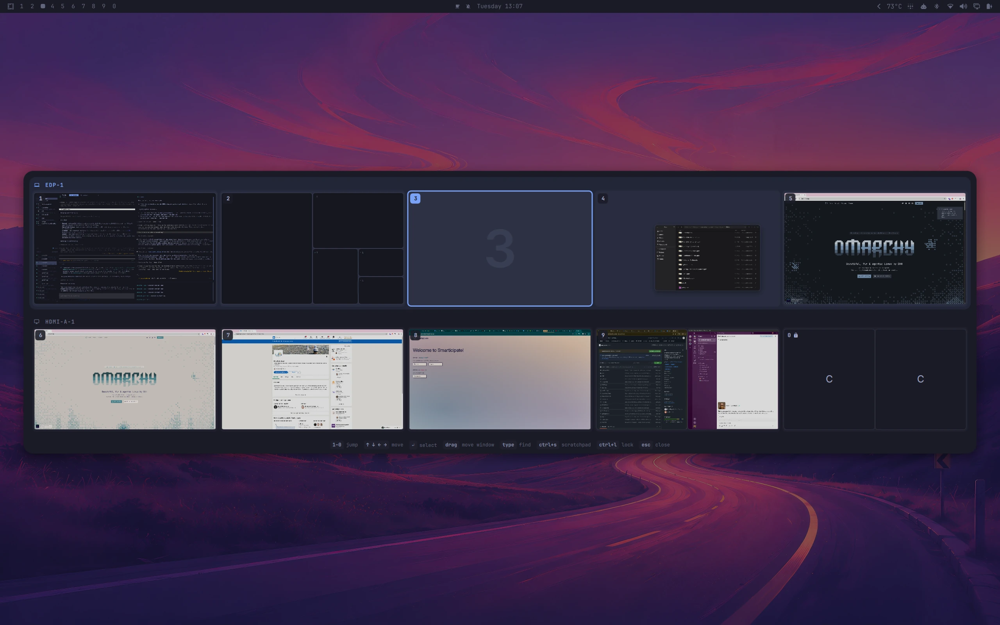
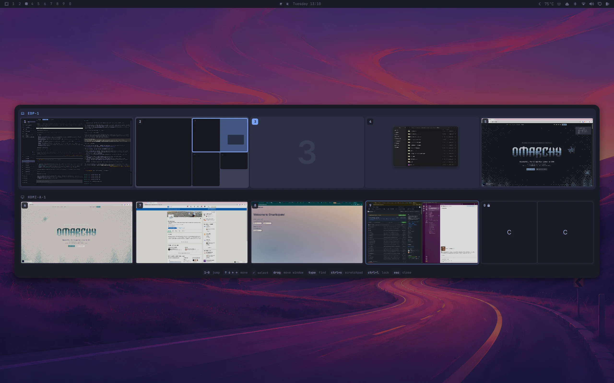
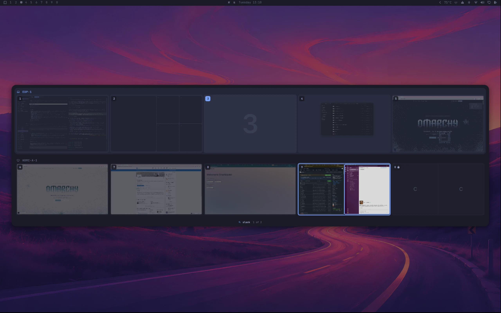
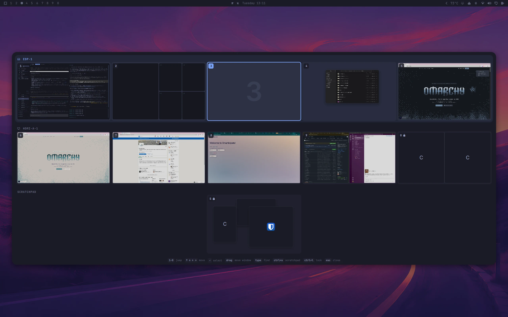
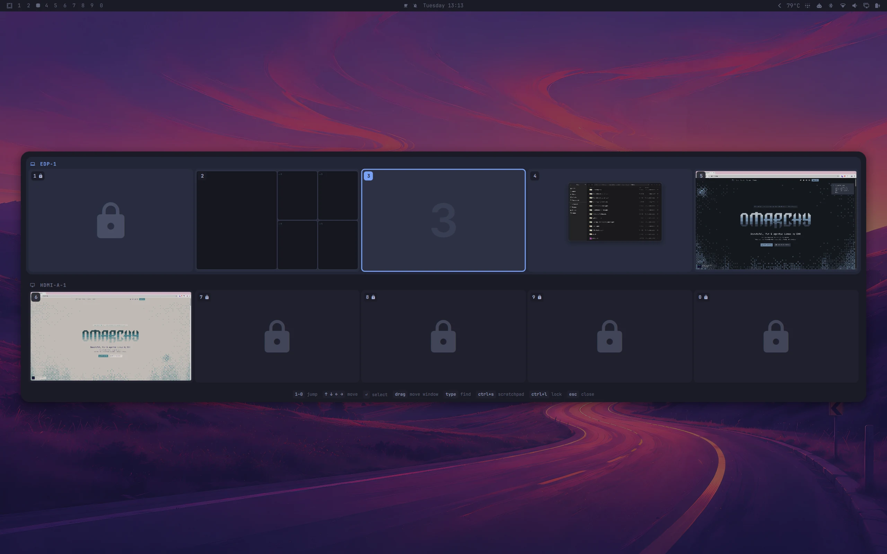
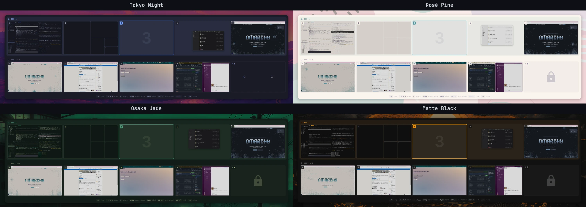

# Omyview

A workspace overview overlay for [Omarchy](https://omarchy.org)'s Quickshell shell.
Press **SUPER+P** to get a visual, spatial overview of every workspace — grouped by
monitor, with a **live thumbnail** of each window in its real position — then jump to a
workspace, or **drag a window onto another workspace** to move it there.

Built to replace the dead `walker`-based `workspace-picker.sh` after Omarchy Quattro
removed `walker`.



## Features

- **Live window previews.** Each window is a real, live thumbnail of its contents (via
  Quickshell's `ScreencopyView`), drawn at its true relative position and size, with the app
  icon as fallback. Captures only run while the overview is open.
- **Drag-and-drop between workspaces.** Grab a window and drop it on another workspace box to
  move it there — a *silent* move that doesn't switch you to that workspace. The overview
  stays open so you can keep organizing.
- **Fullscreen-aware.** A workspace with a fullscreen window still shows every window in its real
  tiled slot; the fullscreen one carries a small corner badge. Click the badge to un-fullscreen it
  without leaving the overview. Floating windows always show on top of tiled ones.
- **Per-monitor groups.** Workspaces are grouped per monitor, derived live from Hyprland's
  workspace→monitor mapping, and stacked by workspace number (the group holding `1` first,
  then the one holding `6`, and so on) — the layout never reshuffles depending on which screen
  you open it from. Each group
  carries a chip with a laptop or external-screen icon and the connector name; the focused
  monitor's group sits on a faint accent backdrop. Undocked collapses to a single flush group.
- **Always 1–0.** Workspaces `1`..`10` are always shown, even ones Hyprland has not created yet,
  so every number key has a visible target (`workspaces` in the config, `0` to turn it off).
- **Fast selection.** Number keys jump (`1`–`9`, `0` = 10), arrow keys move the highlight +
  `Enter`, click a window to focus it, middle-click to close it. `Esc` or a click outside closes.
- **Type to find:** any letter starts a fuzzy filter over window class and title; matches ring
  in the accent colour, the best one is selected. The arrows move between matching workspaces
  the way they normally move between workspaces, `Tab`/`Shift+Tab` cycle matches by rank,
  `Enter` focuses the selected window, `Esc` clears the query (a second `Esc` closes).
  Digits jump while the query is empty and type once it is not. Ctrl+letter chords are reserved.
- **Scratchpad:** `Ctrl+S` shows Omarchy's scratchpad as its own row below the workspaces
  (hidden on every open). `Enter` or a click on it brings the scratchpad up; drop a window on it
  to send it there silently; find covers its windows while the row is shown.
- **Lock for screen sharing:** `Ctrl+L` arms the selected workspace: its windows are black in
  every screen capture from then on (shares, recordings, screenshots), it carries a lock badge,
  and its box shows icons instead of thumbnails (the compositor denies their export); while a
  share is running the box shows a placeholder instead. Press again to disarm. The set is kept
  in `~/.config/omarchy/omyview-locks.json`. Arming is per workspace: the overview still shows
  every other workspace's live thumbnails to a share viewer, and even an armed box only hides
  its own app icons and window names behind the lock glyph while sharing — arm every workspace
  you don't want seen. While a share is running, any monitor showing an armed workspace gets a
  thin coloured frame around its edges as a local reminder (`lockBorder`/`lockBorderSize` below) —
  that frame is for you only: it is blanked in every capture, so a viewer just sees the plain
  black box and never your windows. It follows whatever that monitor is showing,
  the scratchpad included, and it is click-through and reserves no space. The frame (and the
  placeholder in the overview) can lag a few seconds behind the end of a share: the compositor
  signals sharing per captured frame, so omyview waits out a short grace period before believing a
  share is over, rather than flickering whenever the frames pause.
- **Theme-aware.** Pulls the active Omarchy theme's colors and fonts, so it matches the bar
  and re-themes automatically.
- **Zero idle cost.** The component stays loaded with the shell so open and close can animate,
  but nothing runs until you summon it: captures start when the surface is mapped and stop when
  it hides (only the config-file watcher and one `hyprctl` probe at startup run before that).

---

## Screenshots

**Drag a window to another workspace.** The tile follows the cursor and the target box lights
up; dropping moves the window silently, the overview stays open.



**Type to find.** `slack` matched two windows: they ring in the accent colour, everything else
dims, and the bar counts the matches.



**Scratchpad row.** `Ctrl+S` shows Omarchy's scratchpad below the workspaces; drop a window on
it to send it there.



**Lock for screen sharing.** Armed workspaces carry a lock badge; their windows are black in
every capture, and while a capture is running (here: the screenshot itself) the box shows a lock
instead of its windows.



**Follows your theme.** Tokyo Night, Rosé Pine, Osaka Jade and Matte Black, no configuration.



---

## Install

### Requirements

- Omarchy **Quattro (4.x)** or newer, with the Quickshell shell (`omarchy-shell` on your
  `PATH` — it ships with Omarchy). Quickshell must provide `Quickshell.Wayland`
  `ScreencopyView` + `ToplevelManager` (0.3.x does).
- A **recent Hyprland** (developed against 0.56.2). Omyview uses Hyprland's typed `hl.dsp.*`
  dispatchers for focus/move/close and requires **Lua configuration mode** (`hyprland.lua`),
  as used by Omarchy Quattro. A legacy `.conf` session rejects those dispatchers.
- The **dwindle** layout for drag-to-rearrange. On any other layout a tiled drop still moves
  the window to the target workspace, but it is not re-tiled at the drop point (the
  cursor-based insert is a dwindle behaviour). Floating drops work on every layout.

### 1. Add the plugin

```bash
omarchy plugin add https://github.com/Mindful-Stack/omyview.git --enable
```

This clones the plugin into `~/.config/omarchy/plugins/se.mindfulstack.omyview/` (the folder
is named after the manifest `id`, not the repo) and enables it. New plugins default to
disabled, so the `--enable` flag matters — without it, run `omarchy plugin enable
se.mindfulstack.omyview` afterwards.

Verify it's installed and enabled:

```bash
omarchy plugin list | grep omyview
# se.mindfulstack.omyview   enabled   third-party   overlay   Omyview
```

### 2. Bind a key to toggle it

Omyview only appears when you toggle it, so bind a key. **SUPER+P** is the intended bind.

If your Omarchy uses the Lua binding config (`~/.config/hypr/bindings.lua`):

```lua
o.bind("SUPER + P", "Workspace overview", "omarchy-shell shell toggle se.mindfulstack.omyview")
```

If you use plain Hyprland config (`~/.config/hypr/bindings.conf` or `hyprland.conf`):

```ini
bind = SUPER, P, exec, omarchy-shell shell toggle se.mindfulstack.omyview
```

Then reload Hyprland so the bind takes effect:

```bash
hyprctl reload
```

### 3. Use it

Press **SUPER+P**. The overlay opens on your focused monitor.

| Key / action             | Effect                                                    |
| ------------------------ | --------------------------------------------------------- |
| **SUPER+P**              | Toggle the overlay (open and close)                       |
| **1–9, 0**               | Jump to that workspace (`0` = 10)                         |
| **← → ↑ ↓**              | Move the highlight                                        |
| **Enter**                | Jump to the highlighted workspace                         |
| **Drag a window**        | Drop it on another workspace box to move it there (silent)|
| **Click a window**       | Focus that window and close the overview                  |
| **Middle-click a window**| Close that window                                         |
| **Click an empty box**   | Jump to that workspace                                    |
| **Click the ⛶ badge**    | Turn fullscreen off for that window (overview stays open) |
| **Type a letter**        | Start a fuzzy find over window class and title             |
| **Tab / Shift+Tab** (query active) | Cycle matches by rank                             |
| **↑ ↓ ← →** (query active)         | Move spatially among workspaces that hold a match |
| **Enter** (query active) | Focus the selected match and close                        |
| **Esc** (query active)   | Clear the query                                            |
| **Ctrl+S**                          | Show / hide the scratchpad row                        |
| **Enter / click the empty row** (scratchpad) | Bring the scratchpad up and close           |
| **click a tile in the row** (scratchpad) | Focus that window, raised above its siblings   |
| **Ctrl+L**               | Arm / disarm the selected workspace for screen sharing     |
| **Esc / click-out**      | Close                                                     |

Digits jump to a workspace only while the query is empty; once you've typed a letter, digits
are query characters too. Ctrl+letter chords are reserved for future actions.

### Updating

```bash
omarchy plugin update se.mindfulstack.omyview
```

### Uninstalling

```bash
omarchy plugin remove se.mindfulstack.omyview
```

…then delete the SUPER+P bind you added and `hyprctl reload`.

### What it touches on your system

Omyview never edits your Hyprland or Omarchy configuration. Everything it writes is its own:

- `~/.config/omarchy/omyview.json` — **read only**, never created. Your optional settings (see
  Configuration).
- `~/.config/omarchy/omyview-locks.json` — written when you arm or disarm a workspace with
  `Ctrl+L`. Holds the set of armed workspaces so it survives a shell restart.
- `$XDG_RUNTIME_DIR/omyview/share-state` — a one-character file (`0` or `1`) the compositor-side
  observer writes at shell start and whenever a screen share starts or stops, via a temporary
  file next to it that is renamed into place (plus a short-lived probe file when the directory
  is checked). Gone at logout.
- **Runtime Hyprland rules** — omyview talks to Hyprland over its IPC socket with the same Lua
  API your `hyprland.lua` uses. At shell start it installs a share observer (the thing that
  writes `share-state`) and a `no_screen_share` layer rule for its own reminder frame; when you
  arm a workspace it adds a `no_screen_share` window rule for that workspace. All of this lives
  in the running compositor only: disarming disables the workspace rule, `hyprctl reload` drops
  everything and omyview re-installs what is still armed, and nothing is ever written to a config
  file.

`omarchy plugin remove se.mindfulstack.omyview` deletes the plugin directory. Delete the two
files above yourself if you want no trace left.

### Dependencies

Nothing beyond a stock Omarchy Quattro install: Quickshell (`omarchy-shell`), Hyprland with Lua
configuration, `hyprctl` (one probe at startup), and `sh` + `mkdir` (run once from the compositor
to create the runtime directory). No packages are installed and nothing is downloaded at runtime.

### Troubleshooting

- **Nothing happens on SUPER+P.** Check the plugin is `enabled` (`omarchy plugin list |
  grep omyview`) and that your bind targets the exact id `se.mindfulstack.omyview`. Re-run
  `hyprctl reload` after editing the bind.
- **`summon: plugin not enabled` in the shell log.** Run `omarchy plugin enable
  se.mindfulstack.omyview`.
- **It opens on the wrong monitor.** Focused-monitor targeting is verified on a single
  display; multi-monitor is still being validated — see `ROADMAP.md`.

---

## Configuration

Optional user settings live in `~/.config/omarchy/omyview.json` (watched; edits apply live):

```json
{
  "scrim": true,
  "hint": true,
  "workspaces": 10,
  "motion": "auto",
  "lockBorder": "rgb(ff4444)",
  "lockBorderSize": 6
}
```

- `scrim` — dim the desktop behind the picker while it is open (default `true`).
- `hint` — show the key hints under the workspace grid (default `true`).
- `workspaces` — always show workspaces `1`..`N` (default `10`, matching the 1–0 keys), even
  ones Hyprland has not created yet, e.g. a `persistent:true` workspace whose monitor is
  unplugged. A missing workspace is drawn as an empty well next to its numeric neighbours (on the
  monitor of the nearest lower existing workspace), so the layout never depends on which screen
  has focus; Hyprland decides the real monitor when you jump or drop there, and the picker then
  follows. `0` shows only what Hyprland reports.
- `motion` — `"auto"` (default) animates only when Hyprland's `animations:enabled` is on;
  `"full"` always animates; `"off"` never does (every duration is 0).
- `lockBorder` — colour of the share-time reminder frame drawn around a monitor showing an armed
  workspace (default `"rgb(ff4444)"`); only the `rgb(hhhhhh)` / `rgba(hhhhhhhh)` hex forms are
  accepted (Hyprland's own colour syntax), anything else falls back to the default. The alpha of
  `rgba(...)` is honoured, so e.g. `"rgba(ff444480)"` is a half-transparent red.
- `lockBorderSize` — thickness of that frame in pixels, `0`–`20` (default `6`); `0` turns the
  reminder off. The frame is drawn flush against all four screen edges and is a local reminder
  only — it is blanked in every capture, so a viewer sees a plain black box, never your windows and
  never the frame. (Under the paint each strip claims a slightly larger, invisible surface, sized
  so that it lands on whole device pixels at your monitor's scale — that is what keeps the frame
  out of the recording. On an exotic scale where no such size exists within 12 px, a single
  device-pixel hairline of the frame colour can show in a capture; it reveals that a frame is
  there, never what is behind it.)

### Blurred scrim (optional, Hyprland side)

Hyprland can frost the desktop behind the picker instead of only dimming it. This is a
compositor setting, so it lives in your Hyprland config rather than in the plugin, and it needs
blur enabled globally (a GPU cost while the picker is open). Lua config
(`~/.config/hypr/*.lua` on Omarchy Quattro):

```lua
hl.config({ decoration = { blur = { enabled = true } } })
hl.layer_rule({ match = { namespace = "omyview" }, blur = true, ignore_alpha = 0.3 })
```

Classic config:

```ini
decoration:blur:enabled = true
layerrule = blur, omyview
layerrule = ignorealpha 0.3, omyview
```

Colours follow the active Omarchy theme (`menu` surface roles and the shared fill alphas), so
the picker re-themes with everything else. Layout constants live in the `params` object near
the top of `Overview.qml` (cell size caps, `cellInset`, `cellSpacing`, `rowSpacing`, the
`minTileW`/`minTileH` clamps). After editing QML, run `omarchy restart shell` (see the note in
Contributing about why a plain rescan isn't enough).

### Let the picker animate itself (Hyprland side)

Omyview animates its own open and close (a short fade and scale). Hyprland also animates
layer surfaces by default, so without a rule the two stack: a compositor fade on top of the
picker's own. Omarchy gives its shell overlays a `no_anim` rule; give `omyview` the same.
Lua config (`~/.config/hypr/looknfeel.lua` or any file loaded by `hyprland.lua`):

```lua
hl.layer_rule({ match = { namespace = "omyview" }, no_anim = true, animation = "none" })
```

Classic config:

```ini
layerrule = noanim, omyview
```

With `"motion": "off"` (or `"auto"` while Hyprland's `animations:enabled` is off) the picker
does not animate at all, and you may prefer to leave the compositor's layer animation on.

---

## Contributing

Contributions are welcome — bug reports, fixes, and the roadmap items in `ROADMAP.md`.

### Project layout

| File / dir          | What it is                                                              |
| ------------------- | ----------------------------------------------------------------------- |
| `manifest.json`     | Omarchy plugin manifest (id, kind, entry point). Schema v1.             |
| `Overview.qml`      | The overlay: layout, input, drag-and-drop, animation.                   |
| `WindowTile.qml`    | One window thumbnail (live capture or icon fallback).                    |
| `FindBar.qml`       | The type-to-find query bar.                                             |
| `LockFrame.qml`     | The share-time reminder frame around a monitor with an armed workspace. |
| `OmyviewConfig.qml` | Reads and watches `~/.config/omarchy/omyview.json`.                     |
| `OmyviewLocks.qml`  | Armed-workspace state, the share observer and the runtime rules.        |
| `SoftShadow.qml`    | Shadow under floating tiles.                                            |
| `logic.js`          | Pure logic: geometry, reconcile, Lua chunk generation. Unit-tested.     |
| `tests/`            | Tier 1 logic + UI tests (`mise run test`), Lua chunk suite, integration. |
| `DESIGN.md`         | What it does and why.                                                   |
| `docs/specs/`       | One design doc per feature (find, scratchpad, lock, …).                 |
| `ROADMAP.md`        | What's next.                                                            |
| `PLAN.md`           | The v1 build log, with the verified gotchas.                            |

If you're new to Quickshell/QML: it's Qt Quick (declarative UI, JavaScript for logic). You
don't need to know it deeply — the QML files are commented, and the shell
APIs they use (`Hyprland.*`, `Quickshell.*`, `Color.menu.*`) are documented inline in
`DESIGN.md`.

### Local development loop

1. **Work against a live checkout.** The version Omarchy runs lives at
   `~/.config/omarchy/plugins/se.mindfulstack.omyview/` (a clone of this repo). Either edit
   there directly, or clone this repo elsewhere for development:

   ```bash
   git clone git@github.com:Mindful-Stack/omyview.git
   cd omyview
   ```

2. **Edit `Overview.qml`.**

3. **Reload the shell to see the change:**

   ```bash
   omarchy restart shell
   ```

   > ⚠️ **Editing QML requires `omarchy restart shell`, not just a rescan.**
   > `omarchy-shell shell rescanPlugins` reloads the manifest/registry but **not** the live
   > QML component, so your code change won't show until a full shell restart.

4. **Validate the manifest** before you commit (the shell enforces the same checks and will
   silently refuse a bad manifest):

   ```bash
   omarchy plugin validate .
   ```

### Testing

There's no unit-test harness — this is a visual overlay, so "testing" means reloading the
shell and checking behavior. Before opening a PR, confirm:

- [ ] `omarchy plugin validate .` passes.
- [ ] SUPER+P opens and closes the overlay; `Esc` and click-outside close it.
- [ ] Number keys `1`–`0` jump to the right workspace; arrows + `Enter` work; click works.
- [ ] The window mini-map roughly matches your real window layout.
- [ ] It re-themes correctly after `omarchy theme next` (or any theme switch).
- [ ] If you have a second monitor: the two-row layout and per-monitor mini-map coordinates
      are correct (this path is still being validated — call it out in the PR).

### Submitting changes

1. Branch off `main`: `git checkout -b your-change`.
2. Keep commits focused; write a clear message explaining the *why*.
3. If you change behavior, update `DESIGN.md`/`ROADMAP.md` to match.
4. Open a PR against `Mindful-Stack/omyview`. Describe what you tested from the checklist
   above (a screenshot or short screen recording helps a lot for UI changes).

Maintainers: **@DanielThyselius**, **@dotnetemmanuel**.

---

## License

MIT — see [LICENSE](LICENSE).

### Drag regression checks

`mise run test` runs pure layout tests and offscreen Qt mouse-event tests. The latter use
production drag handlers, models, bindings and timers with only shell/compositor adapters
replaced (`tests/ui/prepare.py`); they need Python 3 as well as Qt6 test tooling.

`mise run test-integration` launches an isolated **Lua-configured** Hyprland and real Quickshell.
It checks repeated floating placement on an offset monitor, floating workspace transfer,
tiled workspace transfer without changing the active workspace, and tiled drops that re-tile
left of / above the hovered window and onto a hidden workspace. Requires Hyprland,
Quickshell, foot and jq, plus a running Wayland session for the nested output.

Floating drops keep the full window within the target monitor's usable bounds. Dropping
outside a workspace cancels. A **tiled** drop behaves like Hyprland's own drag-and-drop:
the window is re-tiled as a split of the tile you drop it on, on the side you drop it
(the hovered half is previewed while dragging). With two windows that is a swap; with more
it re-organises the layout. This works across workspaces, including hidden ones, without
changing the active workspace, and an empty destination just fills. Grouped windows are not
re-tiled; fullscreen windows are treated as tiled (the workspace's fullscreen state is restored
after a drop, and a fullscreen window dragged to another workspace arrives tiled). Edge scrolling
helps reach workspaces below the viewport. `mise run test-integration` also runs
`tests/integration/fullscreen.sh` (badge, fullscreen anchors, in-place re-tile).

While in transit the dragged tile is a ghost: it shrinks to 60% around the point you grabbed
and turns translucent, so the drop highlight stays visible. The **pointer** decides where a
tiled window goes (as the cursor does in a native drag); a floating window lands so the grabbed
point ends up under the pointer.
